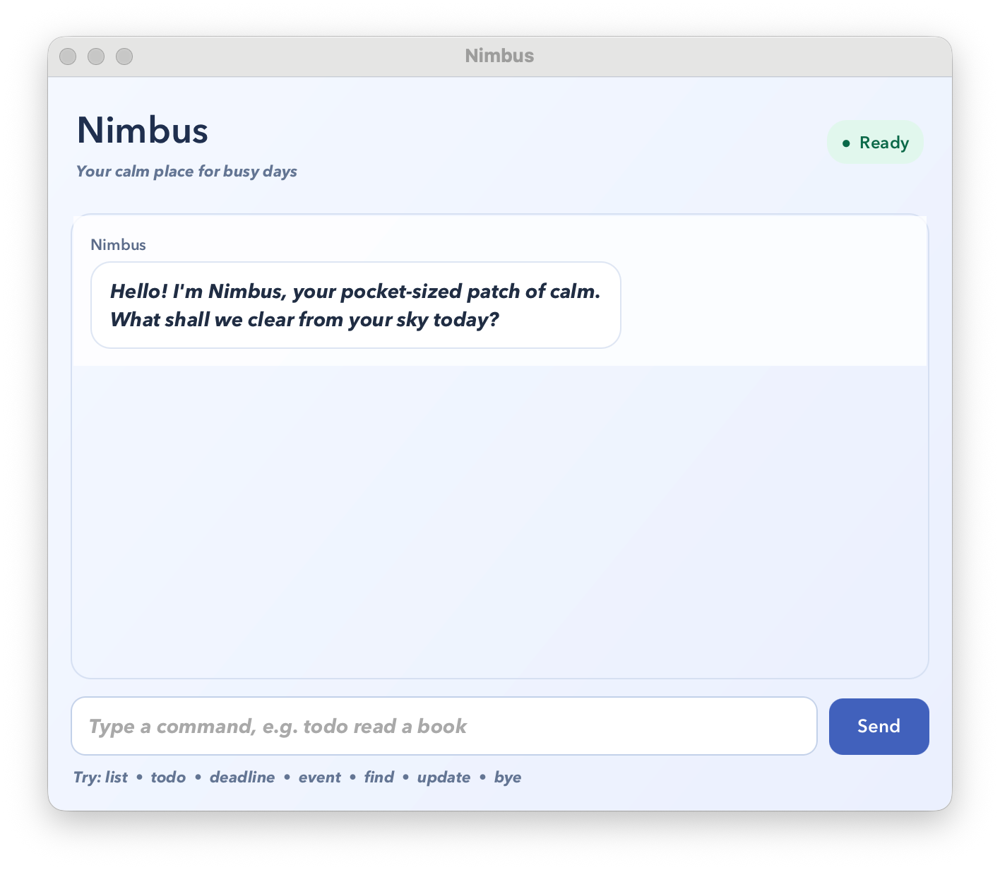

# Nimbus

Nimbus is a calm desktop task assistant for managing todos, deadlines, and events. It stores your tasks locally and gives clear, friendly feedback through a JavaFX chat interface.



## Use Nimbus

Download `nimbus.jar` from the [latest release](https://github.com/shiverin/ip/releases/latest), place it in an empty folder, and run:

```shell
java -jar nimbus.jar
```

Nimbus requires Java 25. See the [Nimbus User Guide](https://shiverin.github.io/ip/) for every command and troubleshooting help.

## Build from source

Run the following command with Java 25:

```shell
./gradlew clean test checkstyleMain checkstyleTest shadowJar
```

The executable application is generated at `build/libs/nimbus.jar`.

## Credits

Nimbus began from the SE-EDU individual-project starter template. The Week 6 GUI, personality, error-handling, testing, and documentation enhancements were developed with OpenAI Codex as an AI coding collaborator.
